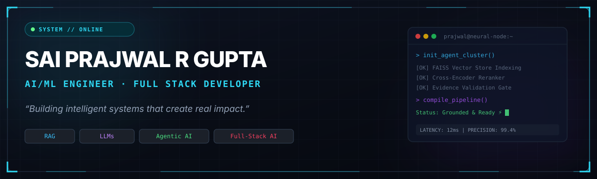
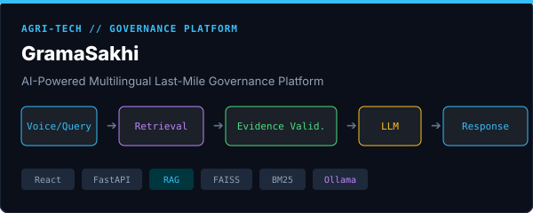
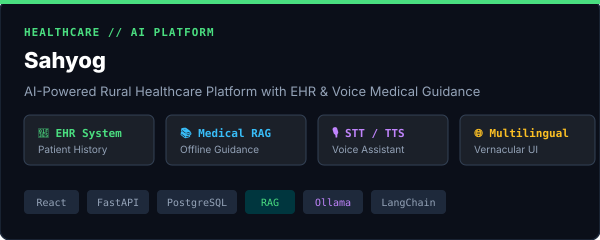
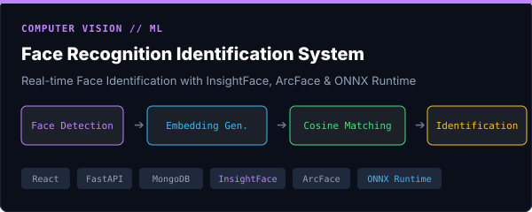
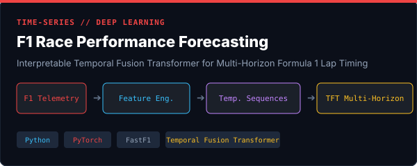
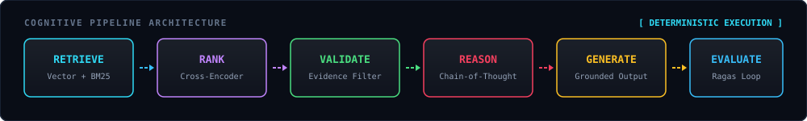

<div align="center">
  
</div>

<br />

<div align="center">

[](https://github.com/SaiPrajwal57)
[](https://github.com/SaiPrajwal57)
[](https://github.com/SaiPrajwal57)
[](https://github.com/SaiPrajwal57)

</div>

---

## 👨‍💻 01 // About Me

I'm an **AI/ML Engineer** and **Full-Stack Developer** focused on building practical AI systems — from intelligent retrieval and LLM applications to complete production-ready products. I work at the intersection of artificial intelligence, software engineering, and real-world problem solving.

<br />

<table>
  <tr>
    <td width="50%" fill="#0f131d">
      <h3>🤖 AI / ML</h3>
      <p><b>Intelligence Layer</b></p>
      <code>RAG</code> • <code>LLMs</code> • <code>AI Agents</code> • <code>Evidence Validation</code>
    </td>
    <td width="50%">
      <h3>⚙️ Full-Stack Systems</h3>
      <p><b>Core Architecture</b></p>
      <code>React</code> • <code>FastAPI</code> • <code>Python</code> • <code>PostgreSQL</code>
    </td>
  </tr>
  <tr>
    <td width="50%">
      <h3>🔬 Active Research</h3>
      <p><b>Frontier Focus</b></p>
      <code>Temporal Deep Learning</code> • <code>AI Evaluation</code> • <code>Hybrid Search</code>
    </td>
    <td width="50%">
      <h3>⚡ Engineering Philosophy</h3>
      <p><b>Operational Creed</b></p>
      <code>Retrieve</code> → <code>Validate</code> → <code>Reason</code> → <code>Deliver</code>
    </td>
  </tr>
</table>

<br />

---

## ⚡ CURRENTLY BUILDING

> **Active Production Focus**  
> Building deterministic, evidence-grounded AI solutions and scalable full-stack products.

<div align="center">

```
🤖 Autonomous AI Agents  │  📚 Evidence-Grounded RAG  │  🧠 LLM Applications  │  🌐 Full-Stack AI Products
```

</div>

---

## 🛠️ 02 // Tech Stack & Tooling

<table width="100%">
  <tr>
    <td width="50%" valign="top">
      <h4>🧠 AI / MACHINE LEARNING</h4>
      
      
      
      
      
      
      
    </td>
    <td width="50%" valign="top">
      <h4>dns BACKEND SYSTEMS</h4>
      
      
      
      
      
    </td>
  </tr>
  <tr>
    <td width="50%" valign="top">
      <h4>💻 FRONTEND ENGINEERING</h4>
      
      
      
      
    </td>
    <td width="50%" valign="top">
      <h4>⚡ AI INFRASTRUCTURE & TOOLS</h4>
      
      
      
      
      
    </td>
  </tr>
</table>

---

## 🚀 03 // Featured Projects

<table width="100%">
  <!-- Project 1: GramaSakhi -->
  <tr>
    <td width="100%">
      <div align="center">
        
      </div>
      <h3>🌾 1. GramaSakhi — Multilingual Governance Platform</h3>
      <p>
        AI-powered multilingual last-mile governance platform delivering verified civic information and scheme access to rural citizens. Built with evidence-validated retrieval to eliminate hallucinations.
      </p>
      <p><b>Architecture Flow:</b></p>
      <pre>Voice / Query  ➔  Retrieval  ➔  Evidence Validation  ➔  LLM  ➔  Response</pre>
      <p>
        <code>React</code> • <code>FastAPI</code> • <code>RAG</code> • <code>FAISS</code> • <code>BM25</code> • <code>Ollama</code>
      </p>
      <p>
        👉 <a href="https://github.com/SaiPrajwal57/Gramasakhi"><b>Inspect GramaSakhi Repository →</b></a>
      </p>
    </td>
  </tr>

  <!-- Project 2: Sahyog -->
  <tr>
    <td width="100%">
      <br />
      <div align="center">
        
      </div>
      <h3>🏥 2. Sahyog — AI Rural Healthcare Platform</h3>
      <p>
        Comprehensive AI-powered rural healthcare platform. Features Electronic Health Records (EHR), patient timeline tracking, offline RAG-based medical guidance, vernacular multilingual support, voice interactions (STT/TTS), and hospital management workflows.
      </p>
      <p><b>Key Capabilities:</b></p>
      <ul>
        <li>EHR & Clinical Patient Timeline Management</li>
        <li>RAG-Grounded Offline Medical Decision Guidance</li>
        <li>Multilingual & Speech-to-Text / Text-to-Speech Interfaces</li>
        <li>Resource-Constrained Hospital Management Operations</li>
      </ul>
      <p>
        <code>React</code> • <code>FastAPI</code> • <code>PostgreSQL</code> • <code>SQLAlchemy</code> • <code>JWT</code> • <code>Ollama</code> • <code>LangChain</code> • <code>FAISS</code> • <code>RAG</code> • <code>STT/TTS</code>
      </p>
      <p>
        👉 <a href="https://github.com/SaiPrajwal57/Sahyog"><b>Inspect Sahyog Repository →</b></a>
        <br />
        <sub style="color: #94a3b8;">*(Note: If private, update URL with your exact repository link)*</sub>
      </p>
    </td>
  </tr>

  <!-- Project 3: Face Recognition Identification System -->
  <tr>
    <td width="100%">
      <br />
      <div align="center">
        
      </div>
      <h3>👁️ 3. Face Recognition Identification System</h3>
      <p>
        Full-stack real-time face identification platform engineered with deep learning face embeddings, low-latency similarity search, and automated enrollment pipelines.
      </p>
      <p><b>Pipeline Architecture:</b></p>
      <pre>Face Detection  ➔  Embedding Generation  ➔  Similarity Matching  ➔  Identification</pre>
      <p>
        <code>React</code> • <code>FastAPI</code> • <code>MongoDB</code> • <code>InsightFace</code> • <code>ArcFace</code> • <code>ONNX Runtime</code>
      </p>
      <p>
        👉 <a href="https://github.com/SaiPrajwal57/Face-Recognition-Identification-System"><b>Inspect Face Recognition Repository →</b></a>
      </p>
    </td>
  </tr>

  <!-- Project 4: F1 Race Performance Forecasting -->
  <tr>
    <td width="100%">
      <br />
      <div align="center">
        
      </div>
      <h3>🏎️ 4. F1 Race Performance Forecasting</h3>
      <p>
        Research and engineering implementation of an interpretable Temporal Fusion Transformer (TFT) model for multi-horizon lap timing, stint degradation, and race pace prediction using official telemetry.
      </p>
      <p><b>Deep Learning Workflow:</b></p>
      <pre>Lap-level Formula 1 Data  ➔  Feature Engineering  ➔  Temporal Sequences  ➔  TFT  ➔  Multi-Horizon Forecasting</pre>
      <p>
        <code>Python</code> • <code>PyTorch</code> • <code>FastF1</code> • <code>Temporal Fusion Transformer</code> • <code>Deep Learning</code>
      </p>
      <p>
        👉 <a href="https://github.com/SaiPrajwal57/f1-tft-race-performance-forecasting"><b>Inspect F1 Forecasting Repository →</b></a>
      </p>
    </td>
  </tr>
</table>

---

## 🧬 04 // Engineering DNA

<div align="center">
  
</div>

<br />

> *"I don't just connect an LLM to an API. I build systems around it."*

---

## 📊 05 // Dynamic Telemetry & GitHub Statistics

<div align="center">
  
  
</div>

<br />

<div align="center">
  
</div>

---

## 🔬 06 // AI & Research

Targeted domains of active research and technical implementation:

- 🔍 **RAG Architectures**: Multi-stage document chunking, hybrid dense/sparse retrieval, and contextual reranking.
- ⚡ **Hybrid Retrieval**: Combining vector similarity (FAISS) with lexical keyword matching (BM25).
- 🛡️ **Evidence Validation**: Grounding LLM responses against verified source contexts to prevent hallucinations.
- 🧠 **LLM Applications**: Quantized local LLM deployments, structured JSON schema generation, and prompt engineering.
- 🤖 **Agentic AI**: Multi-agent task execution, tool-calling pipelines, and autonomous reasoning loops.
- 📈 **Temporal Deep Learning**: Time-series forecasting using Temporal Fusion Transformers (TFT) on complex telemetry.
- 🧪 **AI Evaluation**: Systematic LLM and RAG benchmark evaluation (Ragas, Faithfulness, Answer Relevance).
- ⏱️ **Real-Time AI Systems**: Sub-100ms face embedding search and low-latency API inference.

---

## 🤝 07 // Let's Build Something Remarkable

I am always open to discussing **AI/ML Engineering**, **RAG Systems**, **Agentic AI**, **Full-Stack Development**, and **Collaborative Technical Projects**.

<div align="center">

[](https://github.com/SaiPrajwal57)
[](https://www.linkedin.com/in/sai-prajwal-r-gupta-351a0b2a1/)
[]([https://saiprajwal.dev](https://sai-prajwal-r-gupta.vercel.app/))
[](mailto:prajwal.gupta2010@gmail.com)

</div>

<br />

<div align="center">
  <sub>Designed &amp; Engineered by <b>Sai Prajwal R Gupta</b> • Cyberpunk AI Architecture</sub>
</div>
